## 金山前端大作业

client/server目录下的README分别对应前端和服务端的简介

### 前端项目简介：

名称：数据管理平台

技术栈：react/react-router/redux

markdown实现：react-markdown/markdwon-nav

异常页面实现：react-error-boundary


### 前端项目初始化

#### cra创建client前端项目

前端利用cra脚手架快速创建本次项目结构

```
npx create-react-app client --template typescript
```

安装必要依赖项

```
npm i react-router react-router-dom
npm i @types/react-router @types/react-router-dom
npm i react-redux @reduxjs/toolkit
...
```

#### 配置eslint和prettier

之后在开发环境安装eslint/prettier和相关插件：

```
npm i eslint prettier -D 
npm i eslint-config-prettier eslint-plugin-prettier -D
```

配置eslint/prettier：

本次eslint规则：

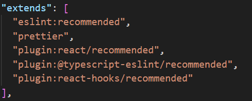

#### 配置tailwindcss

```
npx tailwindcss init -p
```

并配置好tailwind.config.js和postcss.config.js
这里tailwindcss使用了typograph

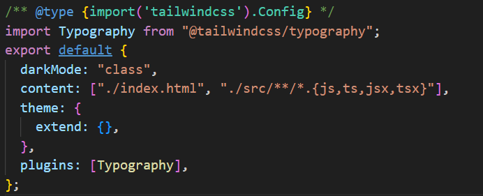


### 前端项目目录结构

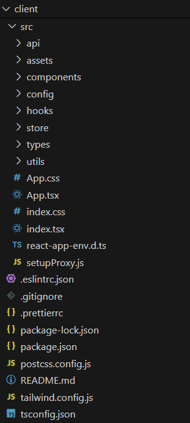

以上为前端项目目录结构

#### api文件夹

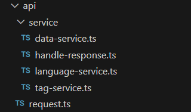

**主要功能：**封装与服务端交互的请求服务函数，与服务端交互的逻辑不必在组件里面直接暴露，直接调用封装好的服务接口服务函数，复用与后端交互的代码逻辑，提高项目的可维护性

request.ts对axios进行了二次封装

service文件下各个service文件封装了与服务端api接口交互的service服务函数，handle-response文件封装了对响应response的统一处理函数

#### components文件夹

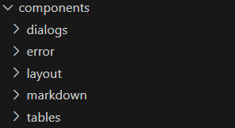

由于本次大作业是单页面网页，所有的组件都放在components文件夹下

**dialogs:** 弹窗组件，含有新增数据弹窗DataDialog组件，新增标签弹窗TagDialog组件

**error:** 捕获异常之后的出错页面ErroFallback组件

**layout:** 整体布局组件，含有侧边栏SiderBar组件，顶边栏NavBar组件

**markdown:** 学习心得渲染markdown组件，含有markdown侧边栏MarkDownSider组件，markdown页面Markdown组件，还有一个CopyButton组件（用于复制markdown页面中的代码的组件）

**table:** 含有数据展示DataTable组件和标签展示TagTable组件

#### config文件夹

language-config.ts：存放中文英文切换的对应文本的ts文件

#### hooks文件夹


**主要功能：**用于存放自定义hook，提取可复用的逻辑，同时减少单个组件内部过多行而难以维护（可以保证单个组件不超过300行）

useData:提取DataTable组件中可复用的逻辑，减少DataTable行数太多难以维护，暴露给DataTable组件使用

useTags:用于从服务端获取标签，可以暴露给比如DataTable/TagTable组件，实现相同逻辑的代码复用

#### store文件夹

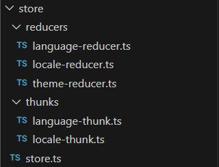

**主要功能：**

①配置redux的store，暴露给App入口组件

②配置reducer（实际createSlice），暴露对应的actions和state

③配置异步thunk，用于初始化时候异步从后端获取初始数据

#### types文件夹

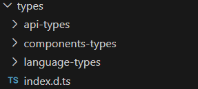

**主要功能：**定义数据接口，通过index.d.ts对外暴露所有数据接口供组件和函数使用

#### utils文件夹

工具类函数文件，含有get-random-color.util.ts文件，封装了获得随机颜色的函数


### 前端项目命名规范

项目目录命名规范：烧烤串命名

项目文件命名规范：烧烤串命名，同时添加类型后缀来便于辨析所在位置和功能

组件命名规范：大驼峰命名

变量/函数命名：小驼峰命名


### 实现的额外功能

#### markdown页面的代码复制功能：

代码模块会出现代码复制功能，点击复制按钮即可复制，并且有一个动画效果

使用了tailwindcss和lucide-react图标库，成功配置了tailwind.config.js

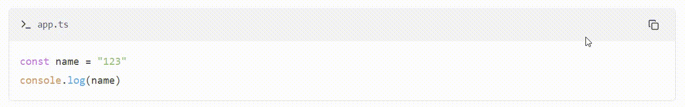

#### 黑暗模式

设置按钮左边增加了一个太阳/月亮图标，点击之后可以切换主题颜色：黑暗/明亮

#### 数据加载动画

数据表格页面数据未加载完成会显示加载动画，使用antd中的skeleton实现

#### 捕获异常显示出错页面/子组件崩溃不影响其他组件正常渲染

异常被捕获后会反应给用户，但是子组件崩溃不影响其他组件正常渲染，使用react-error-boundary实现


### 优化

#### 自定义Hook复用代码逻辑

使用自定义hook实现相同的逻辑代码复用

#### 封装与服务端交互的逻辑部分

封装与服务端交互的请求服务函数，与服务端交互的逻辑不必在组件里面直接暴露，直接调用封装好的服务接口服务函数，复用与后端交互的代码逻辑，提高项目的可维护性

实现请求和组件的解耦

#### 拆分大的组件为几个小组件

保证每个组件行数不超过300行，便于后续维护


### 页面实现效果：

#### 学习心得页面：

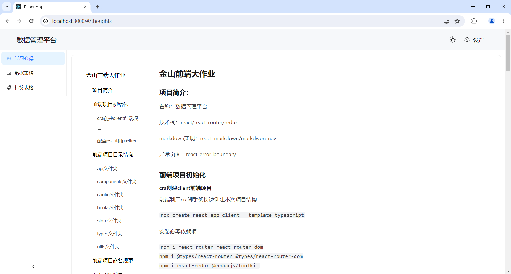

#### 数据表格页面：

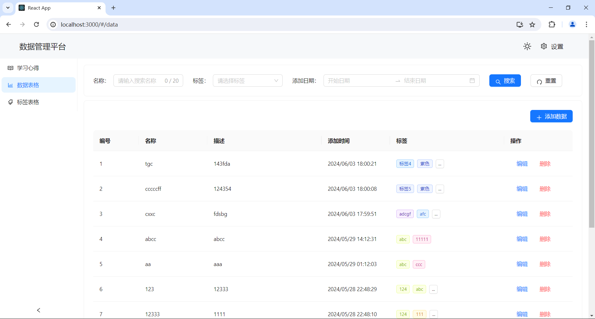

#### 标签表格页面：

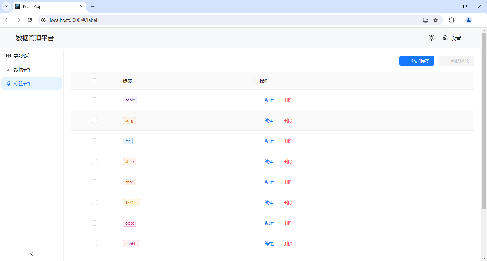

#### 筛选数据页面：

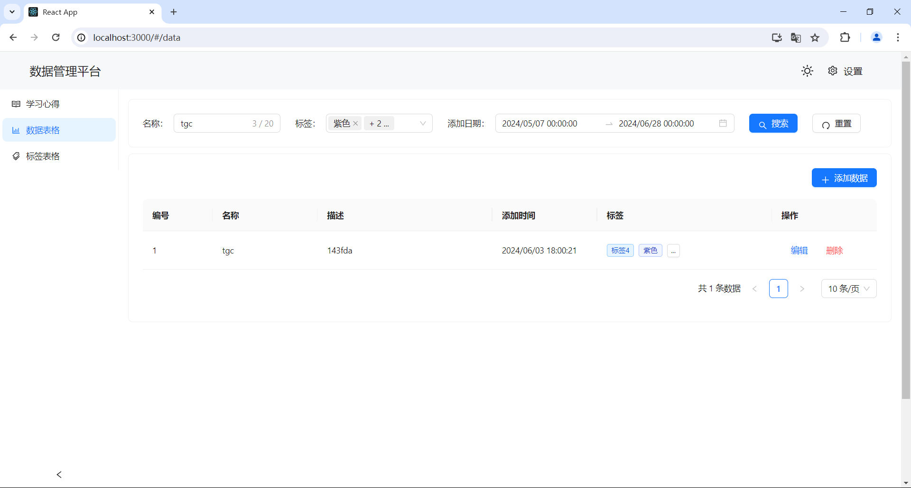

#### 新增数据页面：

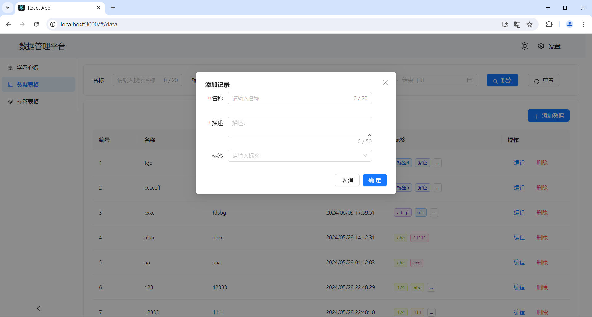

#### 新增标签页面：

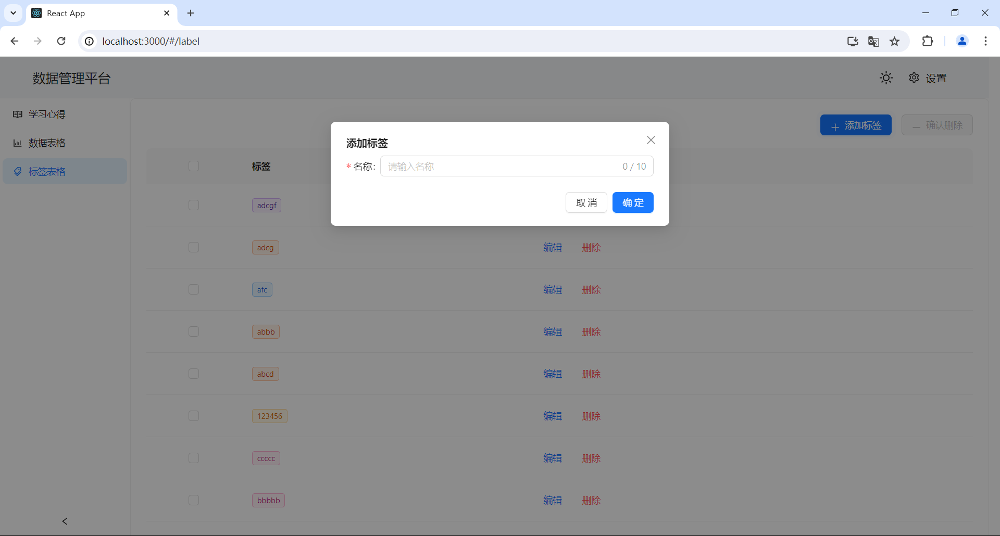

#### 数据表格数据加载动画效果：

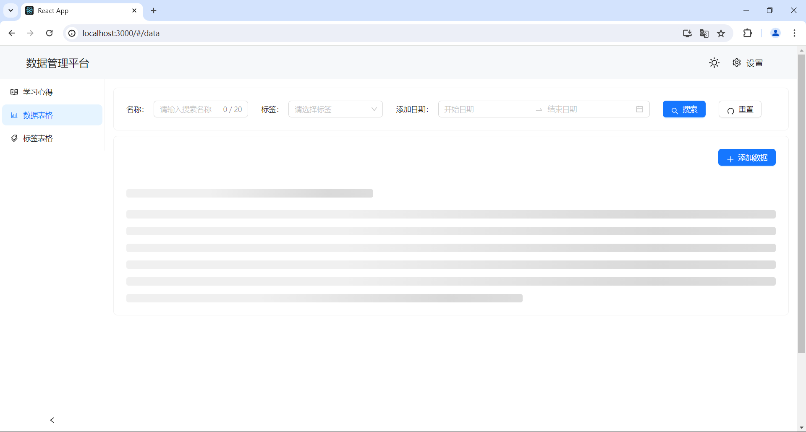

#### 切换英文效果示意图：

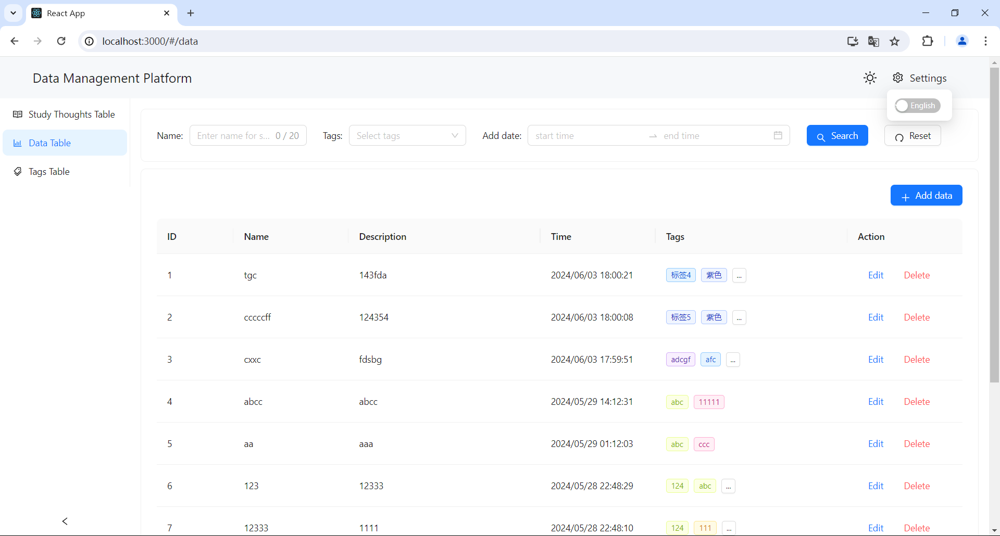

#### 黑暗模式效果示意图：

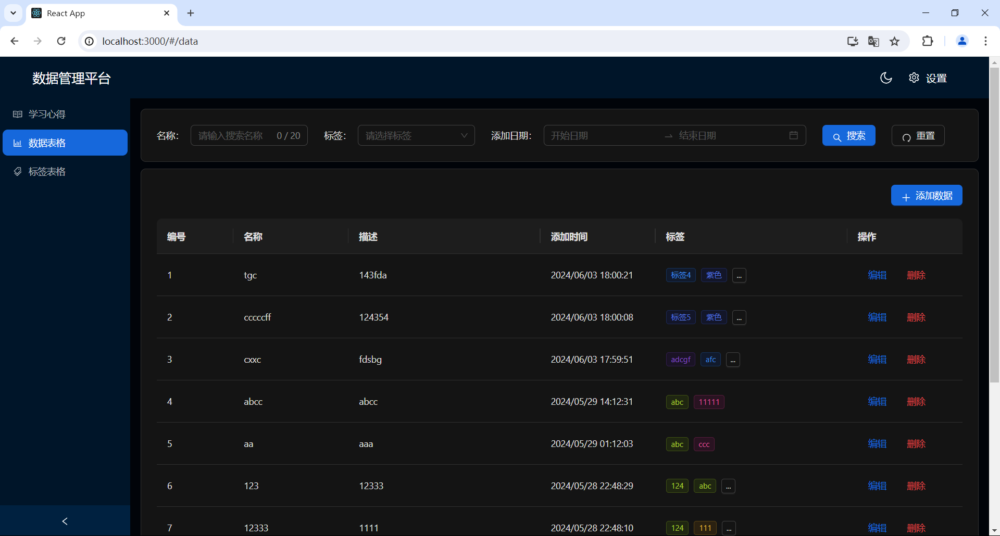

#### 出错页面：

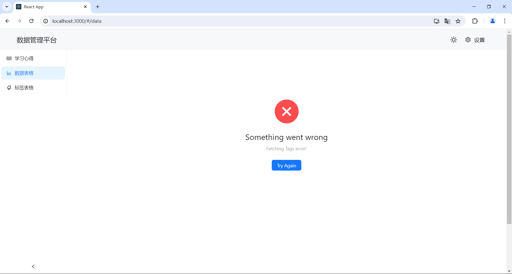

子组件崩溃不影响其他组件正常渲染


### 启动本地静态页面：

#### 如何启动：

npm run start启动服务端后

```
npm run build
```

使用以上指令编译生成build文件，访问http://localhost:3001/index.html即可体验功能

#### 示意图：

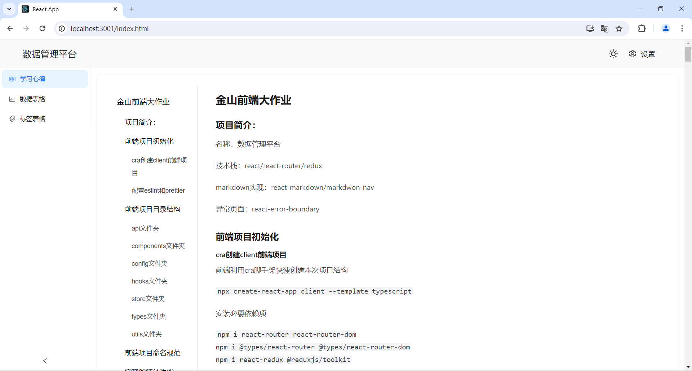


## 服务端：

服务端接口已基本实现

### 补充和完善的接口：

#### getData接口的的service层dataService.getData方法：

service层的data.js中getData过滤数据补充逻辑：

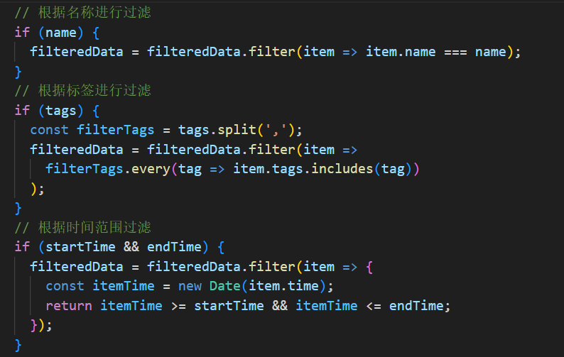

#### tag的editTag接口：

controller层：

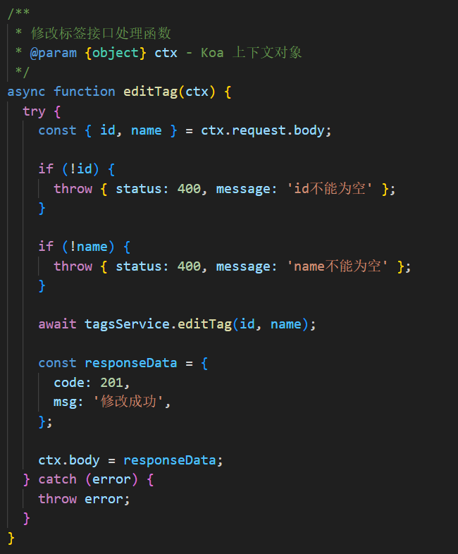

service层：

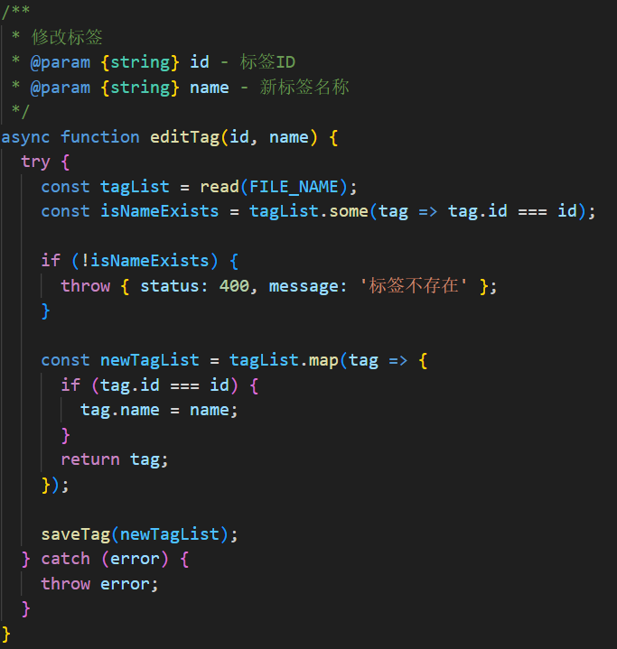

#### 补充批量删除标签接口batchDelTags：

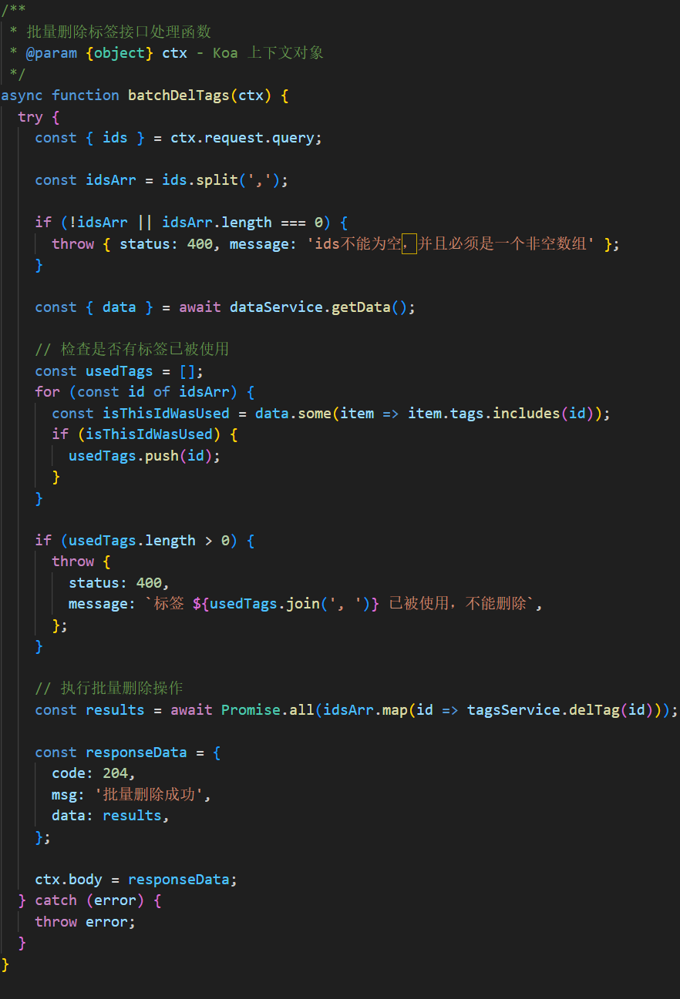

注册路由：url为“/api/tags/batchDelete“

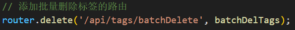

使用了REST风格，由于是批量删除使用了delete方法，而不是post方法

#### 注：

由于delete方法接受的是请求头传递的参数，不太好传递数组，所以在前端把数组转为字符串再穿给后端重新解析为数组再使用

由于getData是get方法，处理方式同上