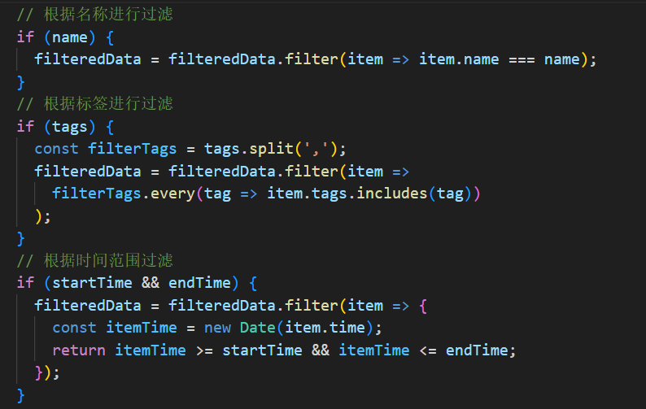
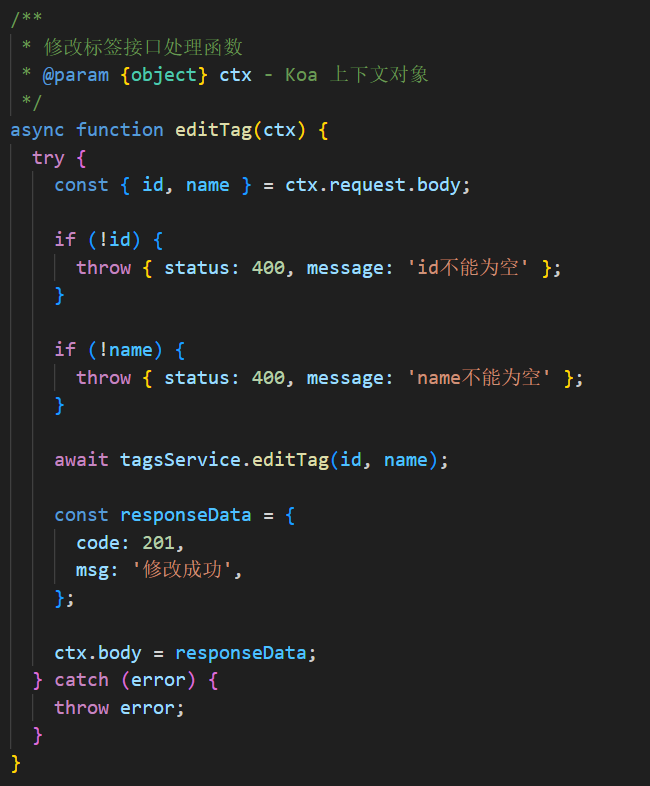
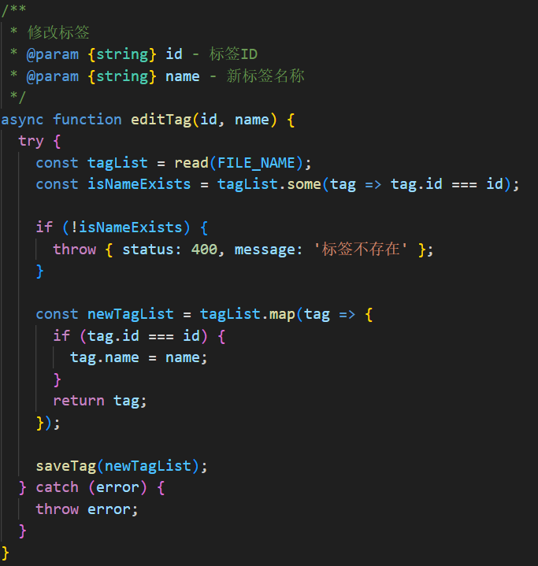
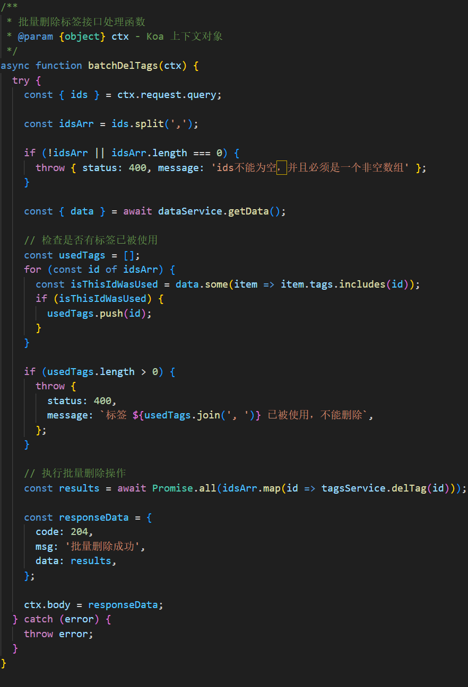
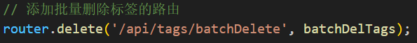

## 服务端：

服务端接口已基本实现

### 补充和完善的接口：

#### getData接口的的service层dataService.getData方法：

service层的data.js中getData过滤数据补充逻辑：

#### tag的editTag接口：

controller层：

service层：

#### 补充批量删除标签接口batchDelTags：

注册路由：url为“/api/tags/batchDelete“

使用了REST风格，由于是批量删除使用了delete方法，而不是post方法

#### 注：

由于delete方法接受的是请求头传递的参数，不太好传递数组，所以在前端把数组转为字符串再穿给后端重新解析为数组再使用

由于getData是get方法，处理方式同上